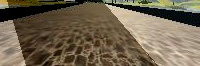

# Behavioral Cloning
This is a brief overview of my Behavioral cloning project. I started with the Nvidia model initially and I found out
that it was sufficient to complete the project. I have experimented with several different configurations
before settling on the configuration described below. The main thrust was to experiment and complete
the project with some new additions.

## Usage
There are two major portions of the system. There is a behaviour training component which is coded
in the model.py file. The model.py file has some parameters which can be setup inside the file. 
The paths to training and validation folders can be set here. For the  sack of training here I have kept
the training and validation file to be the same. 

The drive.py is the main  driving component which drives the vehicle inside the simulator. It requires
access to the saved model parameters file, which in our case is the model.h5 and model.json files.


## Generator
The training and validation functions are generators which when called return a set of image and label lists. 
They take 2 inputs each. The first input described the path where a particular dataset and the next parameter specifies the
batch size of the data to be returned. 
The training data generator is different from the validation data generator because it contains the options to generate the 
augmented images using the random shadow, a small jitter and flipping options.


#Architecture

The following diagram shows the architecture of the model which was used by me. It roughly follows the Nvidia Model 
but I wanted to experiment with different types of layers and parameters I have chosen to modify it a bit. 

**_Has an appropriate model architecture been employed for the task?_**
My neural network model is based on the Nvidia model but it is modified a bit to make something new. The model uses the 
5 convolutional layers with (32,64,128,128,128) Filters with (5,5) and (3,3) sizes. Input to the model is normalized using the 
Lambda layer.

**_Has an attempt been made to reduce overfitting of the model?_**
Dropout layers have been used extensively to reduce overfitting.

**_Have the model parameters been tuned appropriately?_**
Nadam optimizer has been used which is a modified version of the Adam optimizer.


1. The first layer is a normalization layer. THe input to this layer takes 66x200x3 images.
2. Most of the activation function in the layers use the PReLU. It is much more smoother activation function. 
I have also experimented with additional LeakyRelu but found out that it was causing a jerky motion during driving.
3. Dropout layer were used to prevent overfitting
4. The Nestrov Adam optimizer was used for optimization.
The complete architecture was modelled as shown below.
```
____________________________________________________________________________________________________
Layer (type)                     Output Shape          Param #     Connected to                     
====================================================================================================
Normalization (Lambda)           (None, 66, 200, 3)    0           lambda_input_1[0][0]             
____________________________________________________________________________________________________
convolution2d_1 (Convolution2D)  (None, 31, 98, 32)    2432        Normalization[0][0]              
____________________________________________________________________________________________________
prelu_1 (PReLU)                  (None, 31, 98, 32)    97216       convolution2d_1[0][0]            
____________________________________________________________________________________________________
convolution2d_2 (Convolution2D)  (None, 14, 47, 64)    51264       prelu_1[0][0]                    
____________________________________________________________________________________________________
prelu_2 (PReLU)                  (None, 14, 47, 64)    42112       convolution2d_2[0][0]            
____________________________________________________________________________________________________
convolution2d_3 (Convolution2D)  (None, 5, 22, 128)    204928      prelu_2[0][0]                    
____________________________________________________________________________________________________
prelu_3 (PReLU)                  (None, 5, 22, 128)    14080       convolution2d_3[0][0]            
____________________________________________________________________________________________________
convolution2d_4 (Convolution2D)  (None, 3, 20, 128)    147584      prelu_3[0][0]                    
____________________________________________________________________________________________________
prelu_4 (PReLU)                  (None, 3, 20, 128)    7680        convolution2d_4[0][0]            
____________________________________________________________________________________________________
convolution2d_5 (Convolution2D)  (None, 1, 18, 128)    147584      prelu_4[0][0]                    
____________________________________________________________________________________________________
prelu_5 (PReLU)                  (None, 1, 18, 128)    2304        convolution2d_5[0][0]            
____________________________________________________________________________________________________
dropout_1 (Dropout)              (None, 1, 18, 128)    0           prelu_5[0][0]                    
____________________________________________________________________________________________________
flatten_1 (Flatten)              (None, 2304)          0           dropout_1[0][0]                  
____________________________________________________________________________________________________
dense_1 (Dense)                  (None, 256)           590080      flatten_1[0][0]                  
____________________________________________________________________________________________________
prelu_6 (PReLU)                  (None, 256)           256         dense_1[0][0]                    
____________________________________________________________________________________________________
dropout_2 (Dropout)              (None, 256)           0           prelu_6[0][0]                    
____________________________________________________________________________________________________
dense_2 (Dense)                  (None, 128)           32896       dropout_2[0][0]                  
____________________________________________________________________________________________________
prelu_7 (PReLU)                  (None, 128)           128         dense_2[0][0]                    
____________________________________________________________________________________________________
dropout_3 (Dropout)              (None, 128)           0           prelu_7[0][0]                    
____________________________________________________________________________________________________
dense_3 (Dense)                  (None, 64)            8256        dropout_3[0][0]                  
____________________________________________________________________________________________________
prelu_8 (PReLU)                  (None, 64)            64          dense_3[0][0]                    
____________________________________________________________________________________________________
dropout_4 (Dropout)              (None, 64)            0           prelu_8[0][0]                    
____________________________________________________________________________________________________
OutputAngle (Dense)              (None, 1)             65          dropout_4[0][0]                  
====================================================================================================
Total params: 1,348,929
Trainable params: 1,348,929
Non-trainable params: 0
____________________________________________________________________________________________________
```
# Dataset
**_Is the training data chosen appropriately?_**
The dataset is based on the training data available from the the udacity project, but I have added more data to it.
The additional data comes from the driving on the Track 1 and a small bit of Track 2.
The dataset contains images both in reverse and forward direction on track 1. The left and right side images were taken as
an additional data where the steering angle for left side images were increased by 0.3 and for right side image it was 
reduced by 0.3. This values was found after experimentation.
Original dataset contains a large number images which is around 0 degrees. The histogram of distribution of the steering 
angles is shown below:
      

To filter this data and to make the dataset more balanced the angles which appear more than 2000 times
 were restricted around 700. This effectively enhanced the angles which were under represented.
      


The dataset is randomly split into 80/20 portions where 80% is the training and rest is testing set.
The training is enough for 20 epochs over complete dataset. The batch size was chosen to be 256 as my system
was able to handle it gracefully. 

## Image Augmentation
The data is augmented using the three basic techniques in my algorithm:

1. Change in Brightness : The algorithm converts the image from RGB space to HSV space and
 randomly modifies the H value.

2. Random Shadow Generation : The random shadow is generated using the two top and two bottom positions where 
positions are chosen randomly. Then a random value is subtracted from the pixels inside that quadrilateral.
      

       

       


3. Image random rotation : Image is randomly rotated with a small angle.

4. Random Flip : Image is flipped horizontally and the steering angle is negated to balance the left and right turns in
the driving data.


# Experiments and Results
Based on the results achieved it was observed the algorithm learned to drive on the Track 1 
without any major problem. Only real problem was the track 2 which has difficult lightening conditions which
causes troubles for my model. Although my model is able to cover most of track 2 it gets stuck at the end of 
the track which is highly curved. This problem can be solved by adding these curved portions which I intend 
to do in future.
All the settings were tested using the Fastest mode in the simulator with the lowest resolution.

